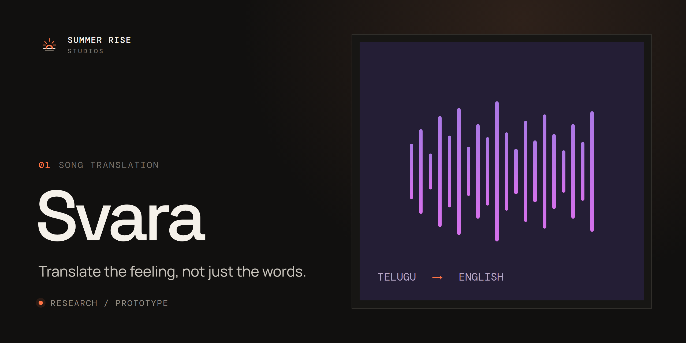

  
  
  

# Svara

**Translate the feeling, not just the words.**

Svara is researching how a song can keep its rhythm, rhyme, and emotion as it crosses languages — starting with Telugu to English.

## What we're working on

A translated song has to get three things right at once:

- **Rhythm:** the new line has to fit the melody it's sung to.
- **Rhyme:** the rhyme scheme should survive the change of language.
- **Emotion:** the feeling of the original has to carry over, not just its dictionary meaning.

## Status

**Research / prototype.** Nothing is released yet, and there's no code in this repository yet. It will land here as development begins. Watch this repository, or [join the list](https://www.summerrise.studio/#contact) to hear when there's a demo, a release, or a research note.

## Contributing

Ideas, feedback, and research pointers are welcome: [open an issue](https://github.com/summerrise-studios/svara/issues/new/choose). Please read the [contributing guide](https://github.com/summerrise-studios/.github/blob/main/CONTRIBUTING.md) and [code of conduct](https://github.com/summerrise-studios/.github/blob/main/CODE_OF_CONDUCT.md) first. To report a security problem, follow the [security policy](https://github.com/summerrise-studios/.github/blob/main/SECURITY.md).

## License

Svara is open source under the [GNU Affero General Public License v3.0](LICENSE).
You can use, study, change, and share it. If you run a modified version as a
network service, you must offer its users the source code of your changes.

For hosted plans, support, or commercial licensing, contact
[jampanikomal@summerrise.studio](mailto:jampanikomal@summerrise.studio).

---

Built by [Summer Rise Studios](https://www.summerrise.studio) · [LinkedIn](https://www.linkedin.com/company/summerrise-studios) · [X](https://x.com/SummerRiseStudi) · [Instagram](https://www.instagram.com/summerrisestudios/)
